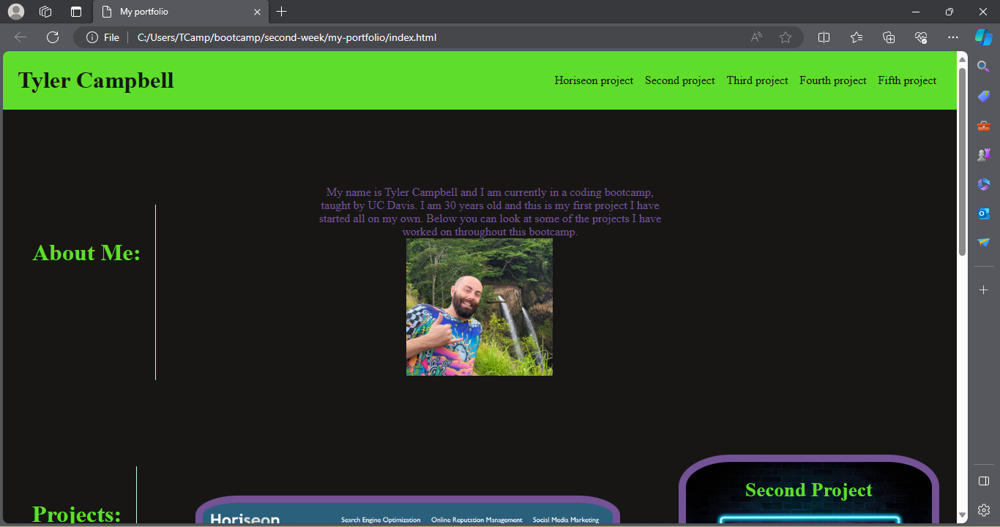

# my-portfolio

## Description

In this project I have created a portfolio in order to showcase what I have learned with HTML and CSS. 
I created this in order to learn more about styling with CSS and to get practice with writing my own code from scratch. 
This project will tell you a little bit about myself and show demonstrations of projects I have completed and there is room for future projects to add to this project.
I learned a lot about creating flexboxes and also creating responsive layouts through media querries.

## Usage

There is a navagition bar at the top of the screen that will scroll you to each project. You can see a thumbnail on the projects that you can click on. The thumbnail will take you to the deployed project on my GitHub page. There is also contact information at the bottom of the page if you are interested in learning more about me. 

## Credits

https://www.w3schools.com/css/
https://developer.mozilla.org/en-US/

## How to view my project

Click this link https://tcampbell-93.github.io/my-portfolio/

Here is a screenshot of the project.
